# 📘 Level Up: Road to Flutter Master

> "Flutter mastery dimulai dari fondasi Dart yang solid."

Project ini adalah kurikulum lengkap dan sistematis untuk menjadi Flutter Developer profesional dari nol. Memahami Dart secara mendalam adalah kunci utama sebelum terjun ke UI Flutter.

---

## 🎯 VISI PROJECT

- **Memahami Dart secara mendalam:** Bukan sekadar hafal sintaks, tapi paham logikanya.
- **Menguasai Flutter secara praktis:** Belajar lewat praktek langsung.
- **Mampu membuat aplikasi nyata:** Siap untuk industri maupun freelance.

## 🧠 FILOSOFI DART

Kenapa kita belajar Dart? Karena Dart dirancang untuk:

- **Produktivitas Tinggi:** Fitur Hot Reload yang legendaris.
- **Type Safety & Null Safety:** Menghindari aplikasi crash di tangan pengguna.
- **Semua adalah Object:** Konsistensi dalam penulisan kode.
- **Async First:** Dibangun untuk aplikasi modern yang butuh koneksi internet.

---

## 🗺️ ROADMAP MENUJU FLUTTER MASTER

## ⚙️ Level 0: Tools & Setup Lingkungan (Prasyarat)

**Deskripsi:** Fondasi paling awal: alat-alat yang diperlukan, cara menginstalnya per OS, dan verifikasi sampai project Flutter pertama bisa dijalankan. Tanpa ini, level berikutnya tidak bisa dijalankan dengan lancar. Langkah pertama di [pathway resmi Flutter](https://docs.flutter.dev/learn/pathway).

- **Materi:** Daftar tools (Flutter SDK, Dart, IDE, emulator/device, Git). Instalasi step-by-step untuk **Windows**, **macOS**, dan **Linux**. Alternatif **DartPad** untuk belajar tanpa install (Level 1–5). Error umum saat pertama kali konfigurasi dan cara mengatasinya. Setelah install: **verifikasi** (`flutter doctor`, `flutter doctor -v`), **project pertama** (`flutter create`, `flutter run`), memilih device (`flutter devices`).
- **Tujuan:** Lingkungan siap untuk menulis dan menjalankan kode Dart/Flutter; tahu kapan pakai DartPad vs VS Code/emulator; bisa mengatasi error konfigurasi pertama.
- **Referensi:** Panduan lengkap di [00-tools-dan-setup](00-tools-dan-setup/README.md). [Flutter Install](https://docs.flutter.dev/get-started/install), [Quick install](https://docs.flutter.dev/learn/pathway/quick-install), [DartPad](https://dartpad.dev).

## 💎 Level 1: Data Types (Fondasi Segalanya)

**Deskripsi:** Memahami jenis-jenis data. Tanpa ini, kita tidak tahu apa yang sedang diproses oleh aplikasi.

- **Primitive:** `int`, `double`, `num`, `String`, `bool`.
- **Collections:** `List`, `Set`, `Map`, `Iterable`.
- **Special:** `dynamic`, `void`, `Never`, `Object`.
- **Modern Dart:** `Nullable Type (?)`, `Record Type`, `Enum`, `Typedef`, **Generics** (`List<T>`, `Future<T>` — untuk collection dan kode reusable, sering dipakai di Flutter seperti `List<Widget>`).
- **Async Types:** `Future`, `Stream`.
- **Tujuan:** Mampu memilih tipe data yang tepat dan menghindari bug "Type Error".

## 🗄️ Level 2: Variables & Scope (Ruang Simpan)

**Deskripsi:** Belajar cara menyimpan data di memori secara efisien.

- **Keywords:** `var`, `final`, `const`, `late`.
- **Scope:** Global, Local, dan Block Scope.
- **Tujuan:** Mengelola lifecycle variabel dan menulis kode aman dari error null.

## 🚀 Level 3: Operators & Control Flow

**Deskripsi:** Memberi "otak" pada aplikasi untuk berhitung dan mengambil keputusan.

- **Operators:** Aritmatika, Perbandingan, Logika, dan Null-aware (`??`, `?.`).
- **Control Flow:** `If-Else`, `Loop` (For, While), `Switch Case` (Pattern Matching).
- **Error Handling (dasar):** `try`/`catch`, `throw`, `rethrow` — perkenalan di sini; konteks HTTP/API akan dibahas lagi di Level 9.
- **Tujuan:** Menguasai logika alur aplikasi yang kompleks.

## 🛠️ Level 4: Functions & Method

**Deskripsi:** Menerapkan prinsip **DRY (Don't Repeat Yourself)**.

- **Materi:** Positional, Named, & Optional Parameters, Arrow Syntax, Anonymous Functions.
- **Tujuan:** Menulis kode yang modular, rapi, dan mudah diuji.

## 🏗️ Level 5: OOP (Jantung Flutter)

**Deskripsi:** Flutter adalah framework berbasis OOP. Level ini adalah yang terpenting.

- **Materi:** `Class`, `Inheritance`, `Abstract Class`, `Mixin`, `Interface`, `Encapsulation`.
- **Tujuan:** Memahami arsitektur aplikasi skala besar (Enterprise).

## 📦 Level 5.5: Package Management (pub.dev)

**Deskripsi:** Memakai dan mengelola dependency (paket pihak ketiga). Diperkenalkan saat mulai Flutter agar bisa memakai paket seperti `http`/`dio` dengan benar.

- **Materi:** `pubspec.yaml`, `flutter pub get`, menambah dependency dari [pub.dev](https://pub.dev), versi (semver), `dev_dependencies`.
- **Tujuan:** Bisa memanfaatkan ekosistem paket Flutter/Dart dengan aman.

## 🎨 Level 6: Widget Basics

**Deskripsi:** Mengubah kode menjadi UI nyata yang cantik. Sesuai [pathway resmi](https://docs.flutter.dev/learn/pathway): layout → DevTools → user input → stateful widgets.

- **Materi:** `Stateless vs Stateful`, `Scaffold`, `Container`, `Row & Column`, `Padding`, `Center`.
- **User Input:** `GestureDetector`, `TextField`, `Form`, tombol (ElevatedButton, TextButton, dll.).
- **DevTools:** Flutter DevTools untuk debug layout dan performance.
- **Tujuan:** Memahami bagaimana membangun layout yang responsif dan menangani interaksi pengguna.

## ✨ Level 6.5: Animasi

**Deskripsi:** Memberi umpan visual (feedback) dan transisi yang halus. Pathway resmi: [Add implicit animations](https://docs.flutter.dev/learn/pathway/tutorial/implicit-animations) setelah stateful widgets.

- **Materi:** Implicit animations (`AnimatedContainer`, `AnimatedOpacity`), explicit animations dasar (`AnimationController`, `Tween`), transisi (Hero, PageRouteBuilder).
- **Tujuan:** UI terasa hidup dan responsif terhadap interaksi.

## 🌐 Level 7: State Management

**Deskripsi:** Mengelola perubahan data agar UI tetap sinkron.

- **Pilihan:** `setState`, `Provider`, `Riverpod`, atau `Bloc/Cubit`.
- **Tujuan:** Membuat aplikasi yang scalable dan mudah dipelihara.

## 📱 Level 8: Navigation & Routing

**Deskripsi:** Mengatur alur perpindahan halaman.

- **Materi:** `Navigator`, `Named Routes`, `GoRouter`.
- **Tujuan:** Alur navigasi aplikasi yang mulus dan profesional.

## 🔌 Level 9: API & Networking

**Deskripsi:** Menghubungkan aplikasi ke internet.

- **Materi:** `HTTP Request`, `JSON Parsing`, `Dio`, `Error Handling`.
- **Tujuan:** Mampu membuat aplikasi yang dinamis dengan data real-time.

## 💾 Level 10: Persistence (Penyimpanan Lokal)

**Deskripsi:** Menyimpan data di perangkat tanpa selalu mengandalkan API. Penting untuk preferensi, cache, dan data offline.

- **Materi:** Key-value (`shared_preferences`), file (`path_provider`, `dart:io` File), database lokal (SQLite via `sqflite` atau Hive).
- **Tujuan:** Aplikasi bisa menyimpan dan memuat data lokal dengan benar.
- **Referensi:** [Persistence](https://docs.flutter.dev/cookbook/persistence), [Data and backend](https://docs.flutter.dev/data-and-backend/persistence)

## 🔥 Level 11: Firebase (Backend as a Service)

**Deskripsi:** Menghubungkan aplikasi ke Firebase: autentikasi dan database cloud tanpa mengelola server sendiri.

- **Materi:** Setup Firebase (FlutterFire CLI / konfigurasi Android & iOS), **Firebase Auth** (register, login email/password, logout, auth state stream), **Cloud Firestore** (koleksi, dokumen, CRUD, rules dasar). Opsional: Realtime Database, FCM, Crashlytics.
- **Tujuan:** Mampu memakai Auth dan Firestore di aplikasi Flutter; paham kapan memilih BaaS vs REST API (Level 9) atau persistence lokal (Level 10).
- **Referensi:** [Firebase for Flutter](https://firebase.flutter.dev/), [FlutterFire CLI](https://firebase.flutter.dev/docs/cli-setup)

## 🧪 Level 12: Testing

**Deskripsi:** Memastikan kode dan UI berperilaku benar; penting menuju level expert.

- **Materi:** Unit test (package `test`), Widget test (`flutter_test`), Integration test (package `integration_test`), menjalankan `flutter test`.
- **Tujuan:** Menulis aplikasi yang bisa diuji dan lebih mudah dipelihara.
- **Referensi:** [Unit testing](https://docs.flutter.dev/cookbook/testing/unit/introduction), [Integration tests](https://docs.flutter.dev/testing/integration-tests)

## 📦 Level 13: Deployment & Publishing

**Deskripsi:** Mempublikasikan karya ke dunia.

- **Materi:** `Build Release`, `App Icon & Splash Screen`, `Play Store & App Store`.
- **Tujuan:** Memahami proses rilis aplikasi dari awal sampai akhir.

## 🔧 Level 14: How Flutter Works

**Deskripsi:** Pemahaman mendalam agar bisa mengoptimalkan dan debug dengan baik. Langkah terakhir di [pathway resmi](https://docs.flutter.dev/learn/pathway/how-flutter-works).

- **Materi:** Widget tree, element tree, render tree, lifecycle widget, rendering pipeline, mengapa Flutter "declarative".
- **Tujuan:** Memanfaatkan framework secara penuh dan menyelesaikan masalah performa/debug dengan tepat.

## 🏛️ Level 15: Arsitektur Proyek Flutter

**Deskripsi:** Mengorganisir kode dan layer agar proyek Flutter scalable, mudah diuji, dan enak dipelihara—penting untuk aplikasi production dan kerja tim.

- **Materi:** Struktur folder (feature-based vs layer-based), separation of concerns (UI / logic / data), Clean Architecture / Feature-first, dependency injection (get_it, riverpod), environment & config, konvensi penamaan dan modularitas.
- **Tujuan:** Mampu merancang dan memelihara proyek Flutter dengan arsitektur yang rapi dan siap berkembang.
- **Referensi:** [15-arsitektur-proyek](15-arsitektur-proyek/README.md)

## 🔐 Level 16: Environment & Config

**Deskripsi:** Mengatur konfigurasi bergantung environment (base URL, API key, debug/prod) tanpa hardcode—penting untuk keamanan dan multi-environment.

- **Materi:** Konsep environment di Flutter vs web; perbandingan **flutter_dotenv**, **--dart-define** / **--dart-define-from-file**, **Envied**; di mana memakai env (API URL, API key, feature flag); praktik aman (.env.example, .gitignore, CI/CD).
- **Tujuan:** Memilih pola config yang sesuai dan menerapkannya di project (contoh praktik di Level 9).
- **Referensi:** [16-environment-config](16-environment-config/README.md), [09-api-networking](09-api-networking/README.md) (contoh flutter_dotenv)

## 🎯 Opsional (Advanced): Advanced UI

**Deskripsi:** UI yang lebih kompleks dan responsif untuk aplikasi production.

- **Materi:** Adaptive layout (phone/tablet/desktop), scrolling lanjutan (`CustomScrollView`, Slivers), advanced layout constraints.
- **Referensi:** [Advanced UI](https://docs.flutter.dev/learn/pathway/tutorial/advanced-ui), [Adaptive layout](https://docs.flutter.dev/learn/pathway/tutorial/adaptive-layout), [Slivers](https://docs.flutter.dev/learn/pathway/tutorial/slivers)

---

## 🧭 Rencana Belajar (Fast Track)

Timeline direvisi agar lebih realistis: state management dan API dipisah per minggu, dengan ruang untuk persistence, testing, dan proyek integrasi.

| Minggu | Fokus Materi | Proyek Praktek |
| :--- | :--- | :--- |
| 0 | Tools & Setup Lingkungan — install + verifikasi + project pertama (atau pakai DartPad untuk Level 1–5) | Cek `flutter doctor`, `flutter create`, `flutter run` / coba DartPad |
| 1 | Setup + Data Types & Variables | Logic Quiz (CLI) |
| 2 | Operators, Control Flow, Error handling + Functions | Calculator CLI |
| 3 | OOP Deep Dive | Simulasi Bank (CLI) |
| 4 | Package management (dasar) + Widget Basics + User input + DevTools | Counter App |
| 5 | Animasi dasar | Animasi sederhana (mis. di Counter) |
| 6 | State Management (setState → Provider/Riverpod) | Todo App atau daftar dinamis |
| 7 | Navigation & Routing | Multi-screen app |
| 8 | API & Networking | Weather App (atau app dengan API) |
| 9 | Persistence (local storage) | Simpan preferensi atau cache data |
| 10 | Firebase (Auth + Firestore) | App dengan login + data cloud |
| 11 | Testing dasar (unit + widget test) | Menambah test ke proyek existing |
| 12–13 | Proyek integrasi + Deployment + How Flutter works | E-Commerce Mini + rilis |
| 14 | Arsitektur Proyek Flutter (struktur folder, Clean Arch, DI) | Review struktur / refactor proyek |
| 15 | Level 16: Environment & Config (dart-define, Flavors, praktik aman) | Config base URL / env di project API atau refactor |

Sesuaikan kecepatan dengan kemampuan; bisa diperpanjang atau dipadatkan.

## 📊 Alur Belajar (Ringkas)

```mermaid
flowchart LR
  subgraph dart [Dart Foundation]
    L0[Setup]
    L1[Data Types]
    L2[Variables]
    L3[Control Flow]
    L4[Functions]
    L5[OOP]
  end
  subgraph flutter [Flutter]
    L6[Widgets + Input + DevTools]
    L6b[Animations]
    L7[State]
    L8[Navigation]
    L9[API]
    L10[Persistence]
    L11[Firebase]
    L12[Testing]
    L13[Deploy]
    L14[How Flutter Works]
    L15[Arsitektur]
  end
  L0 --> L1 --> L2 --> L3 --> L4 --> L5 --> L6 --> L6b --> L7 --> L8 --> L9 --> L10 --> L11 --> L12 --> L13 --> L14 --> L15
```

## 💡 Tips Belajar

1. **Coding Tiap Hari:** Minimal 30 menit.
2. **Jangan Takut Error:** Error adalah guru terbaik di pemrograman.
3. **Praktek > Teori:** Langsung buat project kecil setiap selesai satu level.

---

## 🎯 Target Akhir: Flutter Mastery

Setelah menyelesaikan semua level, kamu akan:
✔ Menguasai Dart secara mendalam.
✔ Mampu membangun aplikasi Flutter yang kompleks.
✔ Siap berkarir sebagai Flutter Developer (Freelance/Full-time).

---

## 📚 Referensi Singkat

- [Flutter Learn Pathway](https://docs.flutter.dev/learn/pathway) — urutan resmi: install → Dart → Flutter tutorial → How Flutter works.
- [Dart Learn](https://dart.dev/learn) — tutorial Dart, type system, control flow, classes, async, null safety.
- [Flutter Persistence](https://docs.flutter.dev/cookbook/persistence) — key-value, file, SQLite.
- [Flutter Testing](https://docs.flutter.dev/cookbook/testing/unit/introduction) — unit dan widget test.

---

## 👥 Contributors

|  |
| :---: |
| [**Kukuh Nova Putra**](https://github.com/kukuhnovaputra/) |
| Creator & Maintainer |

**Ingin berkontribusi?** Silakan buka [issue](https://github.com/kukuhnovaputra/learn-flutter/issues) atau kirim [Pull Request](https://github.com/kukuhnovaputra/learn-flutter/pulls). Kontribusi (koreksi typo, penjelasan materi, contoh kode, atau terjemahan) sangat diterima.

---

**Selamat Level Up!** 🚀
